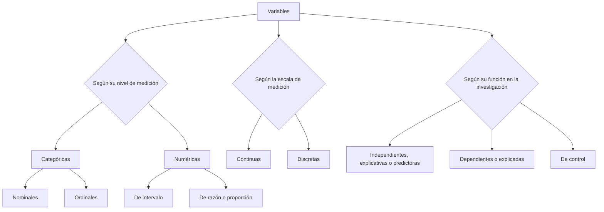

Bienvenido un día más. En la sesión anterior vimos cómo funciona Stata desde la base. Cómo se relaciona con el sistema operativo y cómo cargar una base de datos desde el directorio de trabajo. En esta sesión vamos a empezar a trabajar los datos que vimos la semana pasada, los datos de [Quality of Government](https://www.gu.se/en/quality-government/qog-data).

Para trabajar con datos, el tratamiento de estos suele seguir un patrón claro:
1. Recopilamos los datos,
2. Limpiamos los datos,
3. Finalmente, interpretamos los datos

Lo primero que querríamos hacer para trabajar de forma cómoda, por tanto, es filtrar la base de datos para quedarnos únicamente con las variables en que estamos interesados. Obviamente, **esto es opcional**, si el ordenador con el que trabajamos tiene memoria suficiente (este suele ser el caso hoy en día), podemos trabajar con toda la base de datos original. En caso de que decidamos filtrar, nuestro objetivo será crear una base de datos **nueva**. Será parcial, es decir, será una parte de la original. Y como será una nueva base de datos, tendremos que guardar un nuevo archivo con extensión .dta. Stata contiene dos comandos que permiten filtrar las bases de datos: `keep` y `drop`.

## Limpiando los datos

Como su propio nombre indica, `keep` se queda con las variables que le indiquemos y deshecha las demás. Por ejemplo, si sólo quisieramos trabajar con bci_bci y mad_gdppc, el comando sería el siguiente:

<pre class="sh_Stata">
// La nueva base de datos sólo contendrá las variables bci_bci y mad_gdppc:

keep bci_bci mad_gdppc

// Si queremos guardar la nueva base de datos, utilizamos el comando save:

save mi_nueva_base_de_datos, replace //La opción replace hace que, en caso de existir, el archivo se sobreescriba.
// También fíjate en que el nombre del archivo no tiene espacios. Si los tiene, necesitas encerrarlo entre comillas. Ej:

save "mi nueva base de datos"
</pre>

La otra opción es eliminar aquellas variables con las que no queremos trabajar. Este es un proceso más largo en general, pues necesitamos primero saber todas las variables que existen en nuestra base de datos. Pero se puede hacer. Imagina que quiero quitar una variable en concreto, "version", la sintaxis sería la siguiente:

<pre class="sh_Stata">
// La nueva base de datos NO contendrá la siguiente variable:

drop version

save "mi nueva base de datos"
</pre>

En ambos casos utilizamos el comando `save` para guardar la nueva base de datos. Si no se especifica ninguna extensión, Stata guarda por defecto el archivo en formato .dta, es decir: `mi_nueva_base_de_datos.dta`.

Probablemente te estarás preguntando si no hay una manera más fina de filtrar. En efecto, la hay y es lo que se suele hacer. Esto consiste en filtrar partes de las variables (aunque podrías querer quitar variables enteras). Lo más habitual es que, por ejemplo, sólo quieras trabajar con ciertos valores de una variable. Por ejemplo, sólo con los datos para una región del mundo. Esto también se puede hacer con los comandos `keep` y `drop`. Para ello, simplemente añadimos una condición con la palabra clave **if**:

<pre class="sh_Stata">

// Esto mantiene todas las variables pero sólo mantiene las observaciones que cumplen la condición.
// Es decir, sólo si los valores de ht_region son iguales a 5 esas observaciones sobreviven, si no, se eliminan.

keep if ht_region == 5 //Fíjate en que cuando comparamos (preguntamos), el operador son dos iguales (==).
</pre>

Los operadores **relacionales** que acepta Stata en la condicional (if) son los siguientes:

| Operador | Significado   |
| -------- | ------------- |
| >        | Mayor que     |
| <        | Menor que     |
| >=       | Mayor o igual |
| <=       | Menor o igual |
| ==       | Igual         |
| !=       | No igual      |
| ~=       | No igual      |

También existen operadores **lógicos**, que habrá que combinar con los relacioanles para formar las condicionales:

| Operador | Significado |
| -------- | ----------- |
| &        | Y           |
| \|       | O           |
| !        | No          |
| ~        | No          |

Por ejemplo, podríamos querer que sólo permanecieran las observaciones de dos regiones, Europa Occidental y Norte América, que forman una categoría (la número 5), y Latinoamérica (categoría 2):

<pre class="sh_Stata">

keep if ht_region == 2 & ht_region == 5
</pre>

O también podríamos querer eliminar una región entera, podríamos usar el operador "no igual":

<pre class="sh_Stata">

keep if ht_region != 10 // elimina la región del Caribe
</pre>

Bien, ahora que tenemos sólo las variables y observaciones que queremos, vamos a ver los comandos que nos permiten hacer **tablas de frecuencias**. Estas tablas muestran (si no se pasa ninguna opción al comando) cuántas veces aparece cada valor de una variable en nuestra base de datos, es decir, la frecuencia absoluta. Pero antes de pedir a Stata nuestra primera tabla, recordemos brevemente qué es una variable y qué tipos de variables existen.

### ¿Qué es una variable y qué tipos existen?

En la [sesión anterior](https://rodrigofcaba.github.io/posts/Introducci%C3%B3n-a-Stata/) vimos qué tipos de datos y cómo los clasifica por colores Stata. Pues bien, una variable es “cualquier cualidad o característica de un objeto (o evento) que contenga, al menos, dos atributos (categorías o valores), en los que pueda clasificarse un objeto o evento determinado” (D’Ancona 1996: 126). En general podemos distinguir dos tipos de variables:

- Las que toman **VALORES** numéricos (edad, altura, nivel de ingresos).
- Las que adoptan **CATEGORÍAS** (sexo, estado civil, voto).

> La **medición** de la variable consiste en el proceso de **asignar valores o categorías** a las distintas características que conforman el objeto de estudio (Pinta, 2020).

### Clasificación de variables

Sería muy prolijo entrar aquí en detalles de cada uno de los tipos de variables, los comentaremos en clase y a lo largo de los ejemplos que veamos en Stata.

Para ver los datos, además del visor de datos que vimos la semana pasada, podemos usar tablas. Hagamos una tabla con, por ejemplo, las frecuencias de la variable *gol_est*, que mide el tipo de sistema electoral del Estado. Esta variable es **categórica** y toma tres valores: mayoritario, proporcional o una mezcla.

<pre class="sh_Stata">

<ins>tab</ins>ulate gol_est //el comando tabulate (y cualquera) puede acortarse, por eso he subrayado hasta dónde se podría acortar.

tab gol_est //Hace lo mismo.
</pre>

El resultado de este comando sería el siguiente:

| Electoral System Type-3 classes | Freq. | Percent | Cum.   |
| ------------------------------- | ----- | ------- | ------ |
| Majoritarian                    | 50    | 38.76   | 38.76  |
| Proportional                    | 60    | 46.51   | 85.27  |
| Mixed                           | 19    | 14.73   | 100.00 |
| Total                           | 129   | 100.00  |        |

Como ves, aparece la frecuencia de cada uno de los valores, es decir, cuántas veces la variable toma cada valor. Por ejemplo, de los 129 países en la muestra, 50 tienen un sistema mayoritario. Al lado de la frecuencia obtenemos la frecuencia relativa (en porcentaje) y en la última columna la frecuencia acumulada.

Fíjate que en la celda superior izquierda aparece el nombre de la variable. Esta base de datos está muy ordenada, pero no siempre encontrarás de esta manera los datos. Una buena práctica cuando estamos limpiando los datos consiste en **etiquetar**. En Stata se pueden etiquetar tanto variables como valores (categorías) de las variables. Para ello usamos el comando `label`.

<pre class="sh_Stata">
// Imagina que quieres trabajar con los valores de gol_est en español. Podrías renombrar las categorías y la propia variable como sigue:

label variable gol_est "Tipo de Sistema Electoral"

// Hacemos lo mismo con los valores:

// Primero hay que crear una "variable de etiquetas" y luego asignárselas a la variable que queremos:

label define gol_est_etiqueta 1 "Mayoritario" 2 "Proporcional" 3 "Mixto" // con este comando creo las etiquetas
label values gol_est gol_est_etiqueta // con este se las asigno a la variable gol_est

</pre>

Sin embargo, quizás para tu estudio no te interese --pongamos por caso-- tener la categoría *mixed*. Quizás quieres comparar sólo aquellos países presidencialistas con aquellos con sistemas parlamentarios. Para eso, hay que **recodificar la variable**. Es decir, cambiar cómo están codificados sus valores. Para eso usamos el comando `recode`. Tambien usaremos para esto `replace`, veremos la diferencia más adelante.

<pre class="sh_Stata">
// Recodifica la variable gol_est mandando la categoría mixed a perdidos:

recode gol_est 3 = . // Mando todas las observaciones con valor 3 a la categoría de "valores perdidos"
</pre>

> ¡CUIDADO! Esto modifica la variable original, algo no muy recomenable (aunque no vayas a guardar los cambios en la base de datos). Lo suyo siempre es crear nuevas variables a partir de las originales con cada recodificación:

<pre class="sh_Stata">

clonevar sis_elec = gol_est // clona la variable original en la nueva

recode sis_elec 3 = . // Misma recodificación pero en la nueva variable

</pre>

Obviamente, si se puede enviar cualquier categoría o valor a perdidos, también se pueden, por ejemplo, juntar varias categorías en una, o categorizar variables continuas. Por ejemplo, podría recodificar la variable lp_legor que mide el origen legal del derecho de sociedades de un país para quedarme sólo con aquellos países que siguen la *Common Low* británica (categoría 1). Hay dos maneras (al menos):

<pre class="sh_Stata">
// Forma larga:

<ins>gen</ins>erate commonlaw = . // Primero la creo vacía
recode commonlaw . = 1 if lp_legor == 1 // le pido que tome valor 1 si la original toma valor 1
recode commonlaw . = 0 if lp_legor != 1 // y 0 par el resto de valores

tab commonlaw //Después de una recodificación es bueno hacer una tabla para comprobar el resultado

// Para poder hacer otra recodificación, podemos eliminar esta nueva variable temporalmente con el comando drop:

drop commonlaw

// Forma corta:

gen commonlaw = lp_legor == 1 // Como ves, las condicionales se pueden comprimir mucho en Stata.
</pre>

El último ejemplo de recodificación que me gustaría enseñarte aquí es el siguiente: hagamos tres grupos de la variable continua rel_leg, que mide la intensidad de la legislación religiosa en un país:

<pre class="sh_Stata">

recode biu_relleg (1/10 = 0 "Débil") (11/20 = 1 "Intermedia") (else = 2 "Fuerte"), into("rel_leg")

// Es una manera muy rápida de recodificar una variable, crear una nueva y asignar a los nuevos valores etiquetas todo con un comando.

label variable rel_leg "Nivel de legislación religiosa" // Etiqueto la variable

tab rel_leg // compruebo el resultado
</pre>

## Interpretando los datos

Ahora que ya hemos limpiado los datos filtrando la base de datos, recodificando y etiquetando nuestras variables y observaciones, toca interpretar los datos. Este proceso tiene a su vez dos pasos, a saber, el **análisis descriptivo** y el **análisis exploratorio** (o contraste de hipótesis). Como aún no hemos planteado ninguna hipótesis, vamos a ver algunos ejemplos de análisis descriptivo tanto para variables numéricas como categóricas.

Pongamos en práctica algunas de las cosas vistas más arriba para hacer una tabla de contingencia con los tipos de sistema electoral según las distintas regiones del mundo, para ello, quedémonos sólo con varias regiones, por ejemplo, América Latina y El Caribe (categorías 2 y 10) y Europa y Norte América (categorías 1 y 5):

<pre class="sh_Stata">
recode ht_region (2 10 = 1 "América Latina y El Caribe") (1 5 = 2 "Europa y Norte América") (else = .), into("regiones")

tab regiones

label variable regiones "Regiones"

tab regiones sis_elec, col // Esta tabla cruza los valores de las dos variables, de forma que puedo ver si tienen alguna relación entre ellas. Con la opción col, de column, le pido a Stata que además de mostrar las frecuencias absolutas me muestre porcentajes. En este caso por columnas. Podria hacer lo mismo por filas:

tab regiones sis_elec, row // ¡Cuidado porque los resultados ahora se interpretan de manera difernete!

// También se pueden obtener todos los porcentajes, tanto por filas como por columnas:

tab regiones sis_elec, col row

// Y se pueden quitar las frecuencias absolutas si sólo queremos leer porcentajes:

tab regiones sis_elec, col row nofreq
</pre>

Los resultados de estos comandos son distintos, ya que los porcentajes se interpretan de distinta manera en función de si los obtenemos por filas o por columnas. Por ejemplo, en la tabla con porcentajes por columnas:

La interpretación sería: del total de países con sistema mayoritario, el 68.75% son países de América Latina o el Caribe y el resto de Europa y Norteamérica.
Sin embargo, en el caso de los porcentajes por filas:

La interpretación sería: del total de países de América Latina o el Caribe, el 59.26%  tienen un sistema electoral proporcional, el resto mayoritario, etc.

> ¡¡Es muy importante saber interpretar la tabla en función de si los porcentajes están por filas o por columnas!! El truco está en mirar dónde está el 100% (total), si en filas o en columnas, y tomando eso como referencia, intepretar los porcentajes.
>
También se pueden obtener tablas con resúmenes estadísticos de las variables que quieras. Por ejemplo, una tabla con la media del PIB per cápita en cada región:

<pre class="sh_Stata">
table regiones, c(mean mad_gdppc) format(%9.2f) center //La opcion c significa contenedor, le decimos cuántos parámetros queremos, podemos añadir, por ejemplo la desviación típica y el número de observaciones:

table regiones, c(mean mad_gdppc sd mad_gdppc n mad_gdppc) format(%9.2f) center
</pre>

Resultado:

Un comando que sirve para obtener un resumen estadístico de una variable más sencillo que el comando `table` es el comando `summarize`

<pre class="sh_Stata">
<ins>sum</ins>marize mad_gdppc

// Si queremos más detalles usamos la opción "detail":

sum mad_gdppc, detail // Así además obtenemos la varianza, los percentiles, la asimetría y la curtosis).
</pre>

Antes de pasar al siguiente apartado, recuerda lo que has estudiado en Estadística: la distribución normal es simétrica, es decir, tiene un coeficiente de asimetría de 1 y un coeficiente de curtosis de 3. Esta es su representación gráfica:

## Representando los datos

Una buena manera de interpretar y presentar los datos es gráficamente.

Para ello, hay que saber ante qué tipo de variable o variables nos encontramos. En función de esto, se usan unos u otros gráficos.

### Variables categóricas:

#### Descripción y comparación de categorías:

- **Gráficos de barras:** Indican la media o el porcentaje de cada una de las categorías de una variable. En Stata se usa el comando `graph bar` o `graph hbar` para representarlas en horizontal:

<pre clas="sh_Stata">

graph bar, over(rel_leg) // dentro de la opcion over se indica la variable de agrupación.
</pre>

- **Diagramas de barras apiladas:** Ídem pero con unas barras encima de otras. En stata se añade la opción "Stack" para obtenerlas.
- **Diagrama de sectores:** Indican la parte de cada categoría de una variable representando un área (sector) de un círculo.

<pre clas="sh_Stata">

graph pie, over(sis_elec)
</pre>

### Variables numéricas:

#### Análisis y comparación de distribuciones:

- **Histogramas:** Sirven para ver gráficamente la distribución de una variable. En Stata se obtienen con el comando `histogram`:

<pre class ="sh_Stata">
<ins>hist</ins>ogram mad_gdppc

// Y si usamos la opción "normal" stata superpone una representación de la distribución normal:

hist mad_gdppc, normal
</pre>

- **Diagramas de caja y bigotes:** Como los histogramas, nos informan de la distribución de la variable con alguna información extra, en Stata se obtienen con el comando `graph box`:

<pre class ="sh_Stata">
graph box mad_gdppc
</pre>

#### Distribución conjunta de dos variables:

Para ver la distribución conjunta de dos variables usamos diagramas de puntos o de dispersión. Cada punto representa el valor de la variable x e y al mismo tiempo. Para obtener estos gráficos en Stata se puede usar el comando `graph scatter`, pero es habitual usar scatter dentro del comando `twoway`. Esto es debido a que enseguida veremos que `twoway` nos permite combinar (superponer) varios gráficos y es lo más interesante de cara a intepretar la relación entre las dos variables, los puntos por sí solos no nos dan suficiente información.

<pre class ="sh_Stata">
twoway (scatter cspf_sfi mad_gdppc) //Diagrama de puntos entre el índice de fragilidad del estado y el PIB per cápita.
</pre>

No parece una relación muy lineal.

¿Recuerdas que la variable del PIB no parecía seguir una distribución normal? Es habitual en Ciencias Sociales hacer transformaciones a las variables, una de las más usadas es la **transformación logarítimca**:

<pre class="sh_Stata">
gen lnmad_gdppc=ln(mad_gdppc) // creamos una nueva variable cuyos valores son el logaritmo natural de los de la variable original

// Veamos ahora el histograma:

hist lnmad_gdppc, normal // Ahora la distribución es mucho más normal

</pre>

<pre class="sh_Stata">

// Si ahora representamos el mismo gráfico:
twoway (scatter cspf_sfi lnmad_gdppc)
</pre>

### Superponiendo gráficos:

Podemos usar `twoway` indicando entre paréntesis cada gráfico que queremos, Stata los superpondrá:

<pre class="sh_Stata">

twoway (scatter cspf_sfi lnmad_gdppc) (lfit cspf_sfi lnmad_gdppc) // lfit significa linear fit o ajuste lineal
</pre>

<pre class="sh_Stata">

// Y si queremos ver además los intervalos de confianza de esta recta de ajuste, podemos añadir detrás de "lfit", "ci":

twoway (scatter cspf_sfi lnmad_gdppc) (lfitci cspf_sfi lnmad_gdppc)
</pre>

Terminaremos este post interpretando este último gráfico. Lo que nos indica esta relación lineal es que a medida que aumenta la variable del PIB (en el eje horizontal), disminuye la fragilidad del estado (eje vertical). Como ves, representar los datos es un ejercicio muy útil pues nos da mucha información, sin embargo, con este análisis descriptivo no es suficiente, en la próxima sesión continuaremos con el analisis exploratorio y plantearemos alguna hipótesis para tratar de testarla empíricamente. ¡Hasta entonces!
